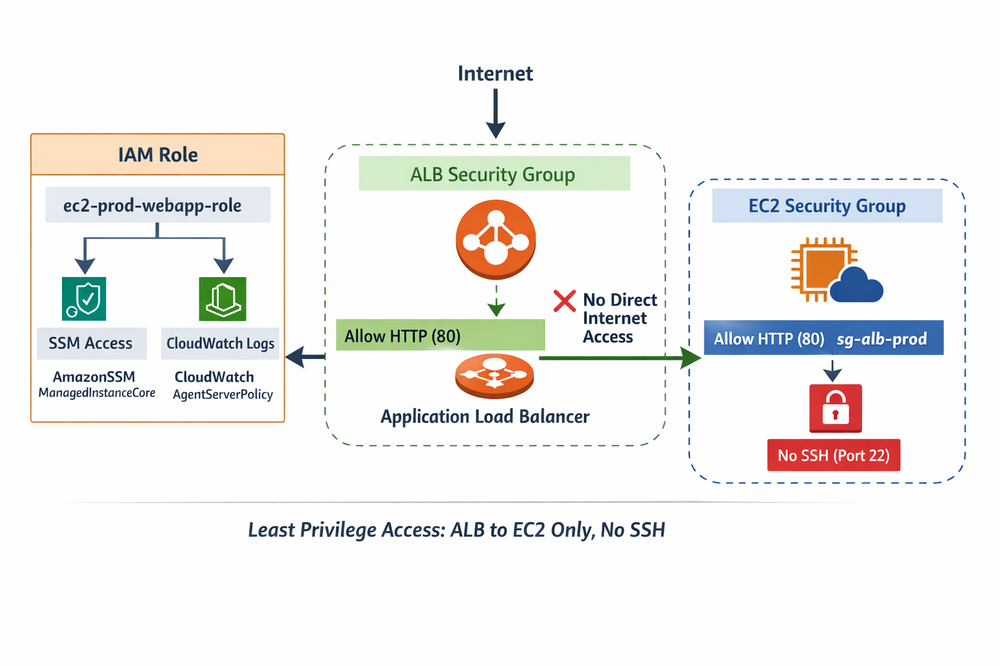
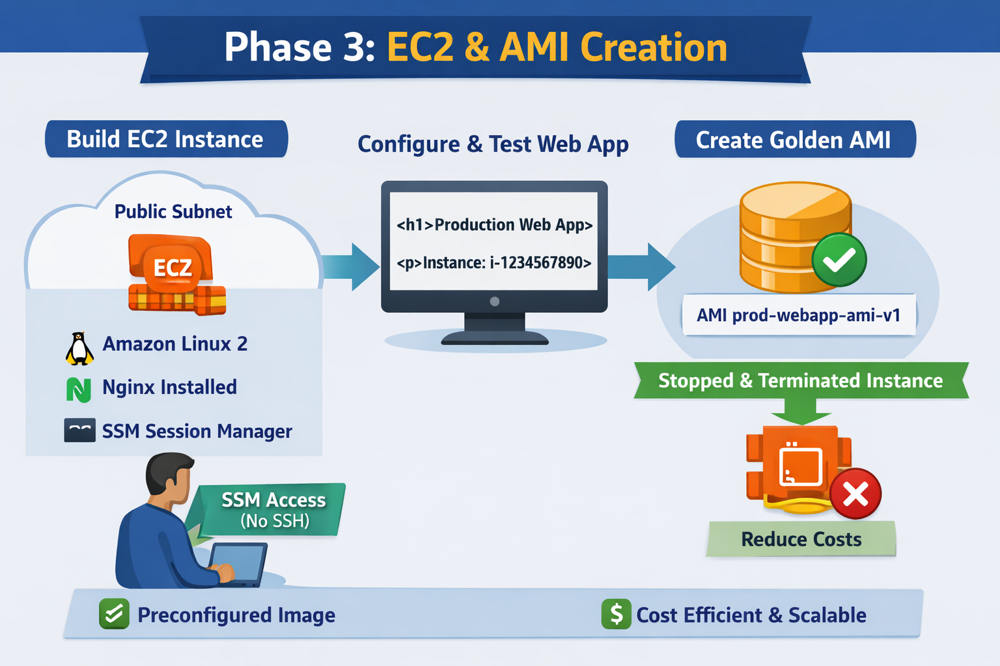

# AWS Production-Ready Web Application (EC2 + ALB + ASG)

## Overview
This project demonstrates the design and implementation of a production-grade web application infrastructure on AWS with a strong focus on security, scalability, and cost awareness.

The project is built incrementally, following real-world DevOps practices.

## Phases Completed
- Phase 1: VPC Design and Network Isolation
- Phase 2: IAM Roles and Security Groups
- Phase 3: EC2 Application Server and Golden AMI creation

## Architecture

### Phase 1 – Network Foundation (VPC)


**Network boundaries**
- Custom VPC (10.0.0.0/16)
- Public subnets for internet-facing components
- Private subnets reserved for application workloads
- Internet Gateway attached only to public route table

---

### Phase 2 – Security Architecture (IAM & Security Groups)


**Traffic flow and trust lines**
- Internet → ALB (HTTP 80 allowed)
- ALB Security Group → EC2 Security Group (HTTP 80 only)
- ❌ No direct Internet → EC2 access
- ❌ No SSH (Port 22) allowed
> This phase ensures that application instances are not directly accessible and can only be reached through controlled, secure paths.


**Identity flow**
- EC2 instances assume IAM role (`ec2-prod-webapp-role`)
- Permissions granted via IAM policies (SSM, CloudWatch)
- No long-lived access keys

---

### Phase 3 – Compute Layer (EC2 & Golden AMI)


**Compute lifecycle**
- Temporary EC2 instance launched for application setup
- Application baked into a golden AMI
- Instance terminated after AMI creation
- AMI reused for future Auto Scaling Groups

---

### End-to-End Flow

```text
User
  |
  v
Internet
  |
  v
[ Application Load Balancer ]
  |
  |  HTTP 80 only (Security Group)
  v
[ EC2 Instances ]
  |
  |  IAM Role (No SSH, No Keys)
  v
AWS Services (SSM, CloudWatch)

```

## AWS Services Used
- VPC
- EC2
- IAM
- Application Load Balancer (upcoming)
- Auto Scaling (upcoming)
- CloudWatch (upcoming)

## Cost Awareness
This project is designed to stay within AWS Free Tier limits. Billable resources such as Load Balancers and NAT Gateways are created only temporarily for validation and then terminated.
- EC2 instances are terminated immediately after AMI creation to avoid unnecessary charges.

## Next Steps
- Phase 4: Load Balancing
- Phase 5: Auto Scaling
- Phase 6: Monitoring and Alerts
