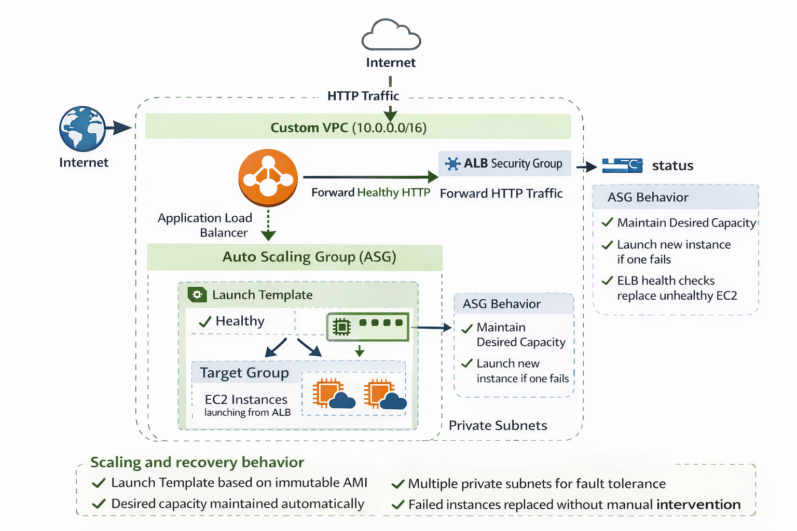
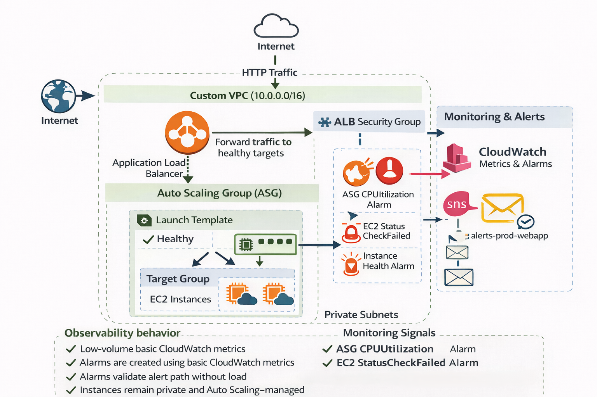

## Overview
This project demonstrates the incremental design and implementation of a production-grade web application infrastructure on AWS with a strong focus on security, scalability, fault tolerance, observability, and cost awareness.

The infrastructure is built step by step following real-world DevOps and cloud engineering practices, emphasizing intent, validation, and operational discipline rather than one-click deployments.

---

## Phases Completed
- Phase 1: VPC Design and Network Isolation  
- Phase 2: IAM Roles and Security Groups  
- Phase 3: EC2 Application Server and Golden AMI Creation  
- Phase 4: Application Load Balancer (ALB) Integration and Validation  
- Phase 5: Auto Scaling Group (ASG) and Self-Healing Infrastructure  
- Phase 6: Monitoring and Alerts (CloudWatch + SNS)  

## Architecture

### Phase 1 – Network Foundation (VPC)


**Network boundaries**
- Custom VPC (10.0.0.0/16)
- Public subnets for internet-facing components
- Private subnets reserved for application workloads
- Internet Gateway attached only to public route table

---

### Phase 2 – Security Architecture (IAM & Security Groups)


**Traffic flow and trust lines**
- Internet → ALB (HTTP 80 allowed)
- ALB Security Group → EC2 Security Group (HTTP 80 only)
- ❌ No direct Internet → EC2 access
- ❌ No SSH (Port 22) allowed

**Identity flow**
- EC2 instances assume IAM role (`ec2-prod-webapp-role`)
- Permissions granted via IAM policies (SSM, CloudWatch)
- No long-lived access keys

> This phase ensures that application instances are not directly accessible and can only be reached through controlled, secure paths.

---

### Phase 3 – Compute Layer (EC2 & Golden AMI)


**Compute lifecycle**
- Temporary EC2 instance launched for application setup
- Application baked into a golden AMI
- Instance terminated after AMI creation
- AMI reused for future Auto Scaling Groups

---

### Phase 4 – Traffic Management (Application Load Balancer)


**Load balancing behavior**
- Internet-facing ALB deployed in public subnets
- Routes HTTP traffic to EC2 instances in private subnets
- Health checks ensure traffic is sent only to healthy targets
- ALB used temporarily for validation and deleted to control cost

---

### Phase 5 – Self-Healing & Scaling (Auto Scaling Group)


**Scaling and recovery behavior**
- Launch Template created from golden AMI
- Auto Scaling Group deployed across multiple private subnets
- Desired capacity maintained automatically
- Failed instances replaced without manual intervention

---

### Phase 6 – Observability & Alerts


**Monitoring and operational visibility**
- CloudWatch used for metrics and alarms
- SNS used for real-time email notifications
- Alarms created at the Auto Scaling Group level to align with ephemeral infrastructure
- Alert delivery validated without generating artificial load

This phase ensures the system is not only deployed but also observable and operable in a production context.

---


### End-to-End Flow

```text
User
  |
  v
Internet
  |
  v
[ Application Load Balancer ]
  |
  |  HTTP 80 only (Security Group)
  v
[ EC2 Instances (Auto Scaling Group) ]
  |
  |  IAM Role (No SSH, No Keys)
  v
AWS Services (SSM, CloudWatch)

```

## AWS Services Used
- VPC
- EC2
- IAM
- Application Load Balancer
- Auto Scaling Group
- CloudWatch
- SNS

## Cost Awareness
This project is designed with AWS Free Tier constraints in mind while still demonstrating production-grade architecture and operational behavior.

- EC2 instances are used temporarily and terminated after AMI creation
- Application Load Balancers are provisioned only for short-term validation and deleted immediately
- Auto Scaling Groups are configured with minimal desired capacity during testing
- NAT Gateways are intentionally avoided unless explicitly required
- Monitoring uses basic CloudWatch metrics and alarms to remain cost-efficient

This approach demonstrates responsible cloud usage without unnecessary expenditure.

## Repository Structure
```text
.
├── README.md
├── architecture/
│   ├── phase-1-vpc.png
│   ├── phase-2-iam-security.png
│   ├── phase-3-ec2-ami.png
│   ├── phase-4-alb.png
│   └── phase-5-asg.png
│   └── phase-6-monitoring-alerts.png
├── docs/
│   ├── phase-1-vpc.md
│   ├── phase-2-iam-security.md
│   ├── phase-3-ec2-ami.md
│   ├── phase-4-alb.md
│   ├── phase-5-asg.md
│   └── phase-6-monitoring-alerts.md
└── screenshots/
```

## Key Takeaways
This project demonstrates the ability to:
- Design secure and isolated AWS networking
- Enforce least-privilege identity and network access
- Build immutable infrastructure using AMIs
- Implement Layer 7 load balancing
- Design self-healing systems with Auto Scaling
- Monitor infrastructure health and design actionable alerts
- Operate AWS environments with cost discipline

---

## Author & Contact

**Dilman Sandhu**  
Aspiring DevOps / Cloud Engineer

- GitHub: https://github.com/dilman0812
- Email: contact.dilman@gmail.com
