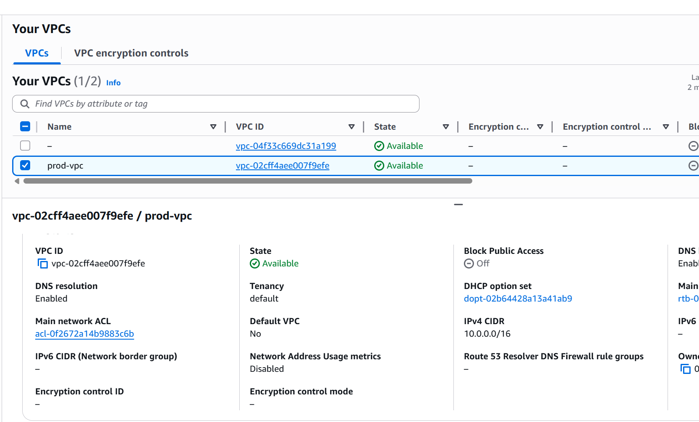
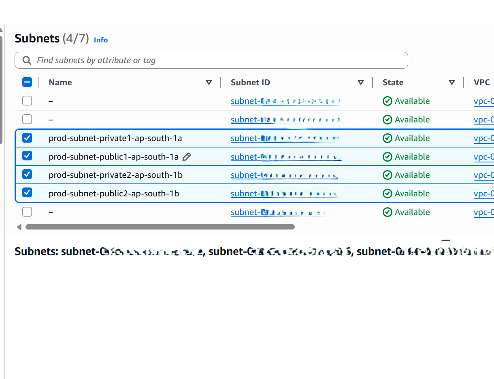
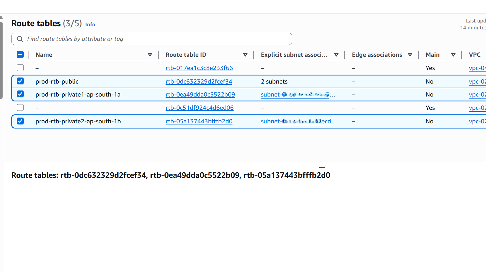
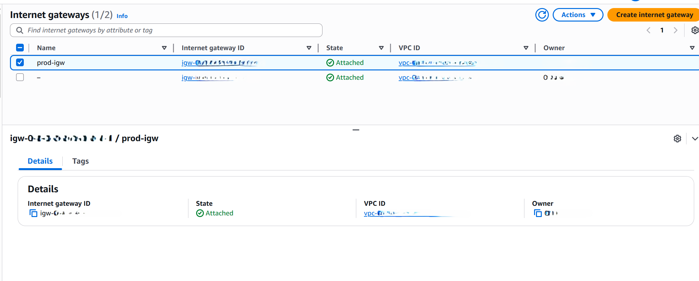

# Phase 1: VPC Setup

## Objective
Design and implement a production-style Virtual Private Cloud (VPC) with proper network isolation and high availability.

## Architecture
- Custom VPC (10.0.0.0/16)
- Two public subnets across different AZs
- Two private subnets across different AZs
- Internet Gateway attached to public subnets
- Separate route tables for public and private traffic

## Key Design Decisions
- Public subnets are used for internet-facing components (ALB).
- Private subnets are reserved for application servers.
- No NAT Gateway was created to stay within AWS Free Tier limits.

## Cost Considerations
- VPC, subnets, route tables, and Internet Gateway are free.
- NAT Gateway intentionally omitted to avoid hourly charges.

## Screenshots

