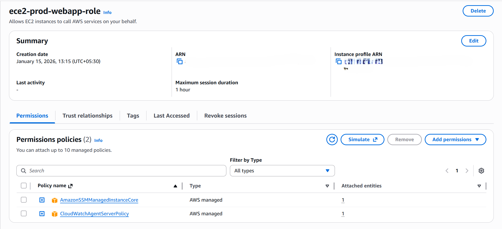
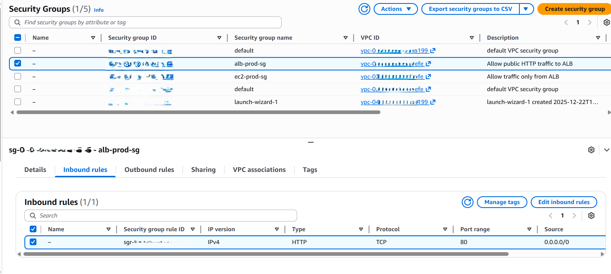
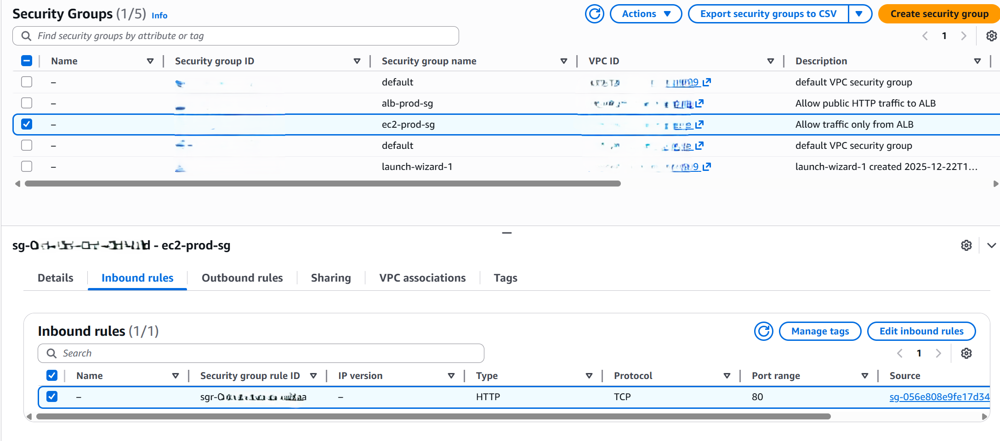

# Phase 2: IAM & Security

## Objective
Implement secure access control and network-level security following AWS best practices.

## IAM Configuration
- EC2 IAM Role with:
  - AmazonSSMManagedInstanceCore
  - CloudWatchAgentServerPolicy
- No access keys stored on instances.

## Security Groups
### ALB Security Group
- Allows inbound HTTP (80) from the internet.
- Acts as the only public entry point.

### EC2 Security Group
- Allows inbound HTTP (80) only from the ALB security group.
- No SSH access enabled.

## Security Rationale
- Enforces least-privilege network access.
- Prevents direct public access to application servers.
- Uses Systems Manager instead of SSH.

## Cost Considerations
- IAM and Security Groups do not incur any cost.

## Screenshots

