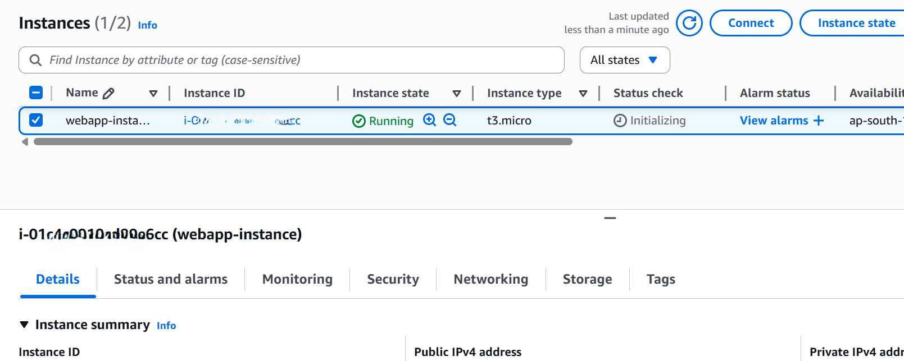
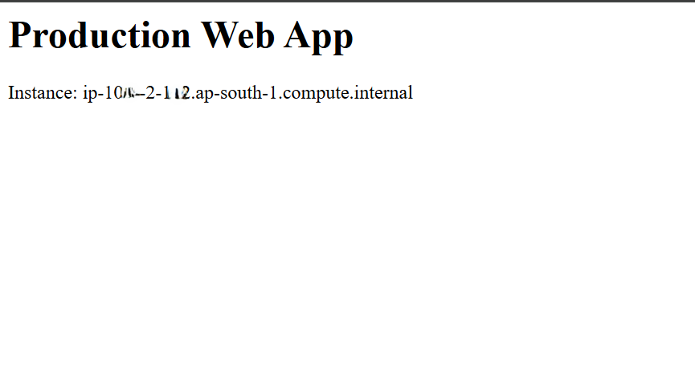
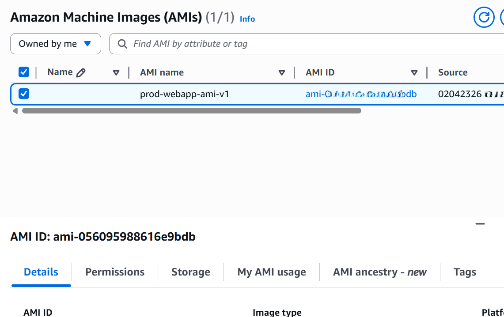

# Phase 3: EC2 Application Server & AMI Creation

## Objective
Create a reusable, production-ready Amazon Machine Image (AMI) for the web application that can be used by Auto Scaling Groups.

## EC2 Configuration
- Instance Type: t3.micro (Free Tier eligible)
- AMI Base: Amazon Linux 2
- IAM Role: ec2-prod-webapp-role
- Network: Public Subnet (temporary)
- Access Method: AWS Systems Manager Session Manager (No SSH)

## Application Setup
- Installed Nginx web server
- Enabled Nginx to start on boot
- Deployed a sample web page displaying instance hostname

## Golden AMI Strategy
After application configuration, the EC2 instance was stopped and a custom AMI (`prod-webapp-ami-v1`) was created. This AMI represents an immutable, preconfigured application image suitable for Auto Scaling.

## Security Considerations
- No SSH access was enabled
- IAM role-based access used instead of access keys
- Instance terminated immediately after AMI creation

## Cost Awareness
- EC2 instance was used only temporarily
- Instance terminated after AMI creation to remain within AWS Free Tier
- Only minimal EBS snapshot storage remains

## Screenshots

