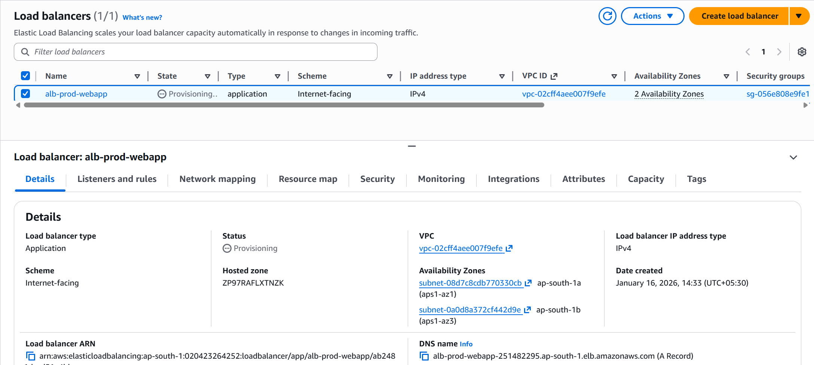
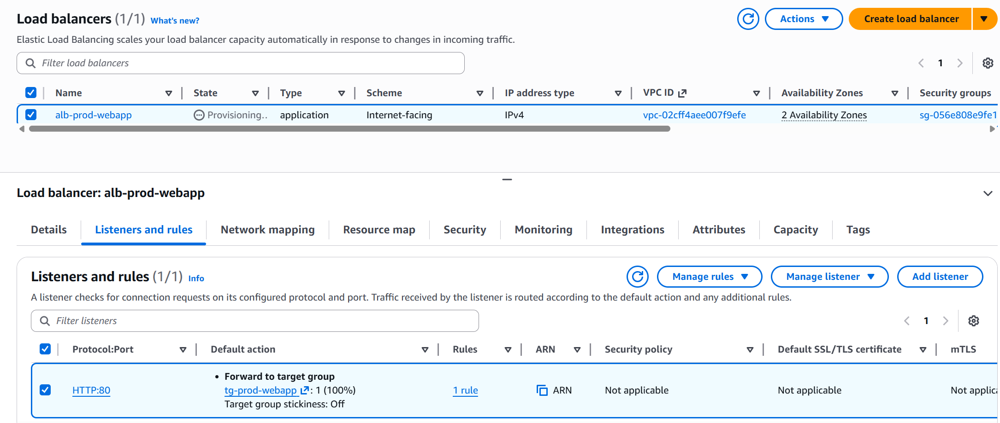
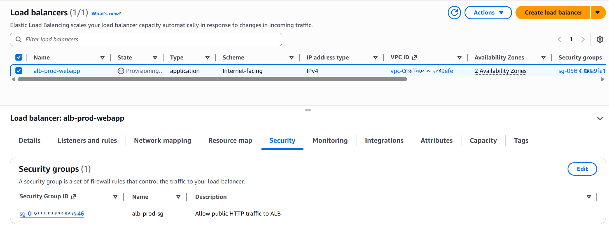
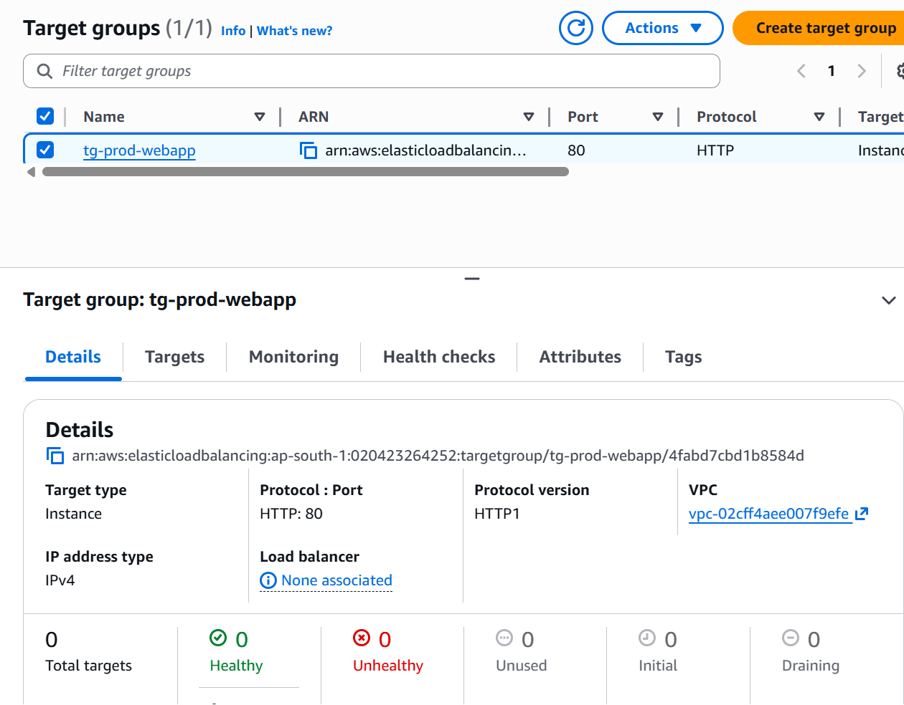
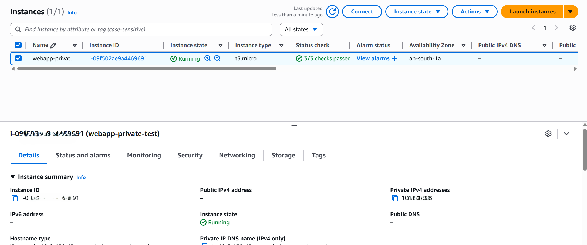
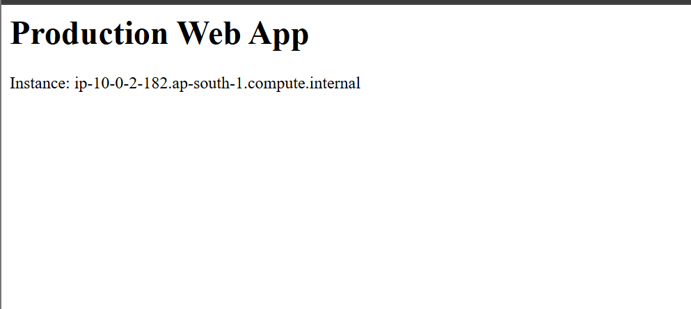

# Phase 4: Application Load Balancer (ALB)

## Objective
Introduce an Application Load Balancer (ALB) to validate Layer 7 traffic routing while integrating with the existing VPC, security groups, and EC2 application server.

This phase focuses on correct traffic flow, security enforcement, and strict cost control.

---

## Architecture Summary
- Internet-facing Application Load Balancer deployed in public subnets
- EC2 application instance running in a private subnet
- Target group used to route traffic from ALB to EC2
- Security groups enforcing controlled ingress and egress

---

## Load Balancer Configuration

### Application Load Balancer
- Type: Application Load Balancer
- Scheme: Internet-facing
- Listener:
  - HTTP : 80 → Forward to target group
- Subnets:
  - public-subnet-1
  - public-subnet-2
- Security Group:
  - Allows inbound HTTP (80) from the internet

**Screenshot:**  
  
  

---

### Target Group
- Target type: Instance
- Protocol: HTTP
- Port: 80
- Health check path: `/`
- Registered targets:
  - EC2 instance launched from `prod-webapp-ami-v1`

**Screenshot:**  
  

---

## EC2 Integration
A temporary EC2 instance was launched from the golden AMI to validate ALB routing.

- Subnet: Private subnet
- Public IP: Disabled
- Security Group: `ec2-prod-sg`
- IAM Role: `ec2-prod-webapp-role`

**Screenshot:**  

---

## Traffic Flow Validation
1. User sends HTTP request to ALB DNS endpoint
2. ALB forwards request to healthy EC2 target
3. EC2 serves the web application response
4. Response is returned to the user via the ALB

**Screenshot:**  

---

## Security Enforcement
- ALB is the only internet-facing component
- EC2 instances do not have public IP addresses
- EC2 security group allows inbound traffic only from the ALB security group
- No SSH access is enabled; access is managed via IAM and Systems Manager

---

## Cost Awareness & Resource Lifecycle
- Application Load Balancers are not eligible for AWS Free Tier
- The ALB was created only for short-term validation
- After successful testing and documentation:
  - The EC2 test instance was terminated
  - The ALB was deleted immediately

This ensures minimal cost while preserving architectural evidence.

---

## Outcome
This phase demonstrates the ability to:
- Design and deploy Layer 7 load balancing
- Integrate networking, security, and compute layers
- Validate real traffic flow
- Manage AWS costs responsibly

---

## Next Phase
Phase 5 will introduce Auto Scaling Groups to enable horizontal scaling and instance self-healing.
