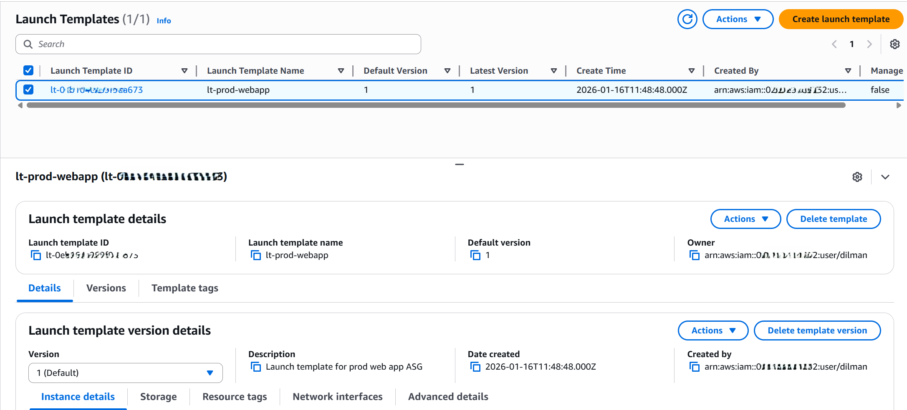
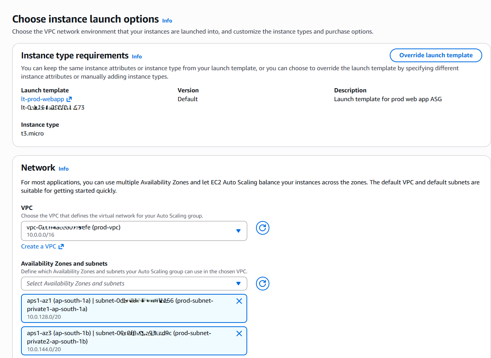
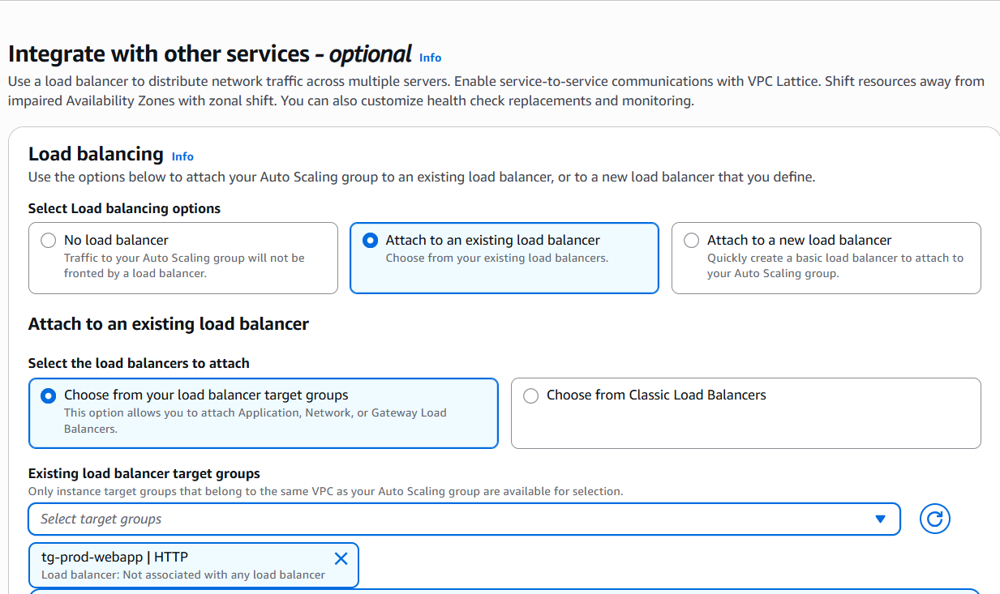
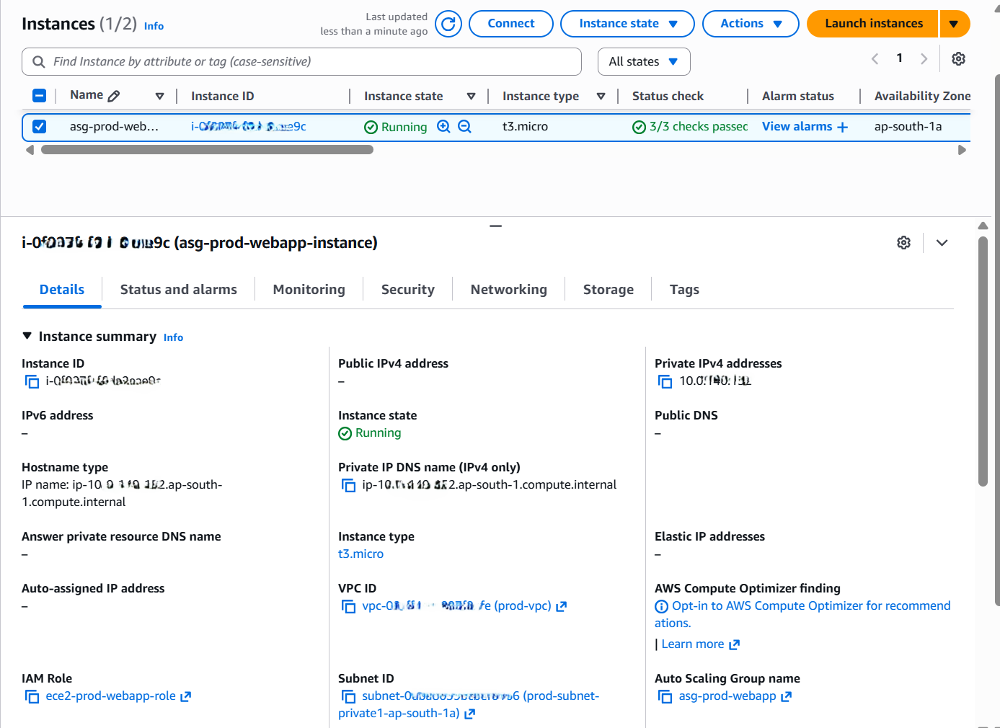
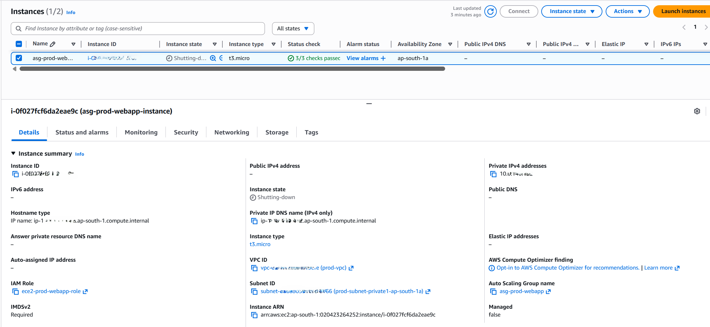

# Phase 5: Auto Scaling Group (ASG)

## Objective
Introduce an Auto Scaling Group (ASG) to enable self-healing and prepare the application for horizontal scalability using immutable infrastructure principles.

This phase focuses on automatic instance replacement, integration with existing load balancing components, and controlled cost usage.

---

## Architecture Summary
- Launch Template created using the golden AMI
- Auto Scaling Group deployed across private subnets
- ASG integrated with existing target group
- Health-based instance replacement enabled

---

## Launch Template Configuration

### Launch Template
- Name: `lt-prod-webapp`
- AMI: `prod-webapp-ami-v1`
- Instance Type: `t3.micro`
- Security Group: `ec2-prod-sg`
- IAM Role: `ec2-prod-webapp-role`
- Key Pair: None (SSM-based access)
- Storage: Default root volume

**Screenshot:**  

---

## Auto Scaling Group Configuration

### Auto Scaling Group
- Name: `asg-prod-webapp`
- VPC: `prod-vpc`
- Subnets:
  - private-subnet-1
  - private-subnet-2
- Capacity:
  - Minimum: 1
  - Desired: 1
  - Maximum: 2

This configuration ensures high availability while remaining within AWS Free Tier limits.

**Screenshot:**  

---

## Load Balancer Integration

The Auto Scaling Group is attached to the existing target group created in Phase 4.

- Target Group: `tg-prod-webapp`
- Health Checks: ELB-based health checks enabled

This allows the ASG to replace instances based on application health rather than only EC2 status.

**Screenshot:**  

---

## Instance Validation

After ASG creation:
- An EC2 instance was launched automatically
- Instance was placed in a private subnet
- No public IP was assigned
- Instance was managed entirely by the ASG

**Screenshot:**  

---

## Failure Simulation (Self-Healing Test)

To validate self-healing behavior:
1. The running EC2 instance was manually terminated
2. The Auto Scaling Group detected the capacity drop
3. A new EC2 instance was launched automatically to restore desired capacity

This confirms that the system can recover from instance failure without manual intervention.

**Screenshots:**  
  

---

## Security Considerations
- EC2 instances are not directly accessible from the internet
- Inbound traffic is restricted to the load balancer security group
- No SSH access is enabled
- IAM roles are used for all AWS service interactions

---

## Cost Awareness & Resource Lifecycle
- Auto Scaling Groups and Launch Templates do not incur direct cost
- EC2 instances use Free Tier eligible instance types
- Desired capacity kept minimal during validation
- After testing:
  - Desired capacity was reduced or ASG deleted
  - No unnecessary instances left running

This ensures cost-efficient validation of production-grade behavior.

---

## Outcome
This phase demonstrates the ability to:
- Implement self-healing infrastructure
- Use immutable AMIs with Auto Scaling
- Integrate compute scaling with health checks
- Operate AWS infrastructure responsibly within cost constraints

---

## Next Phase
Phase 6 will introduce monitoring and alerting using CloudWatch and SNS to complete the production operations workflow.
