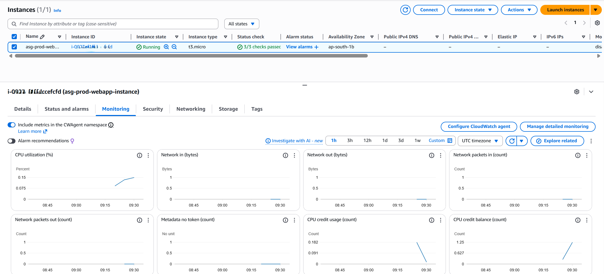
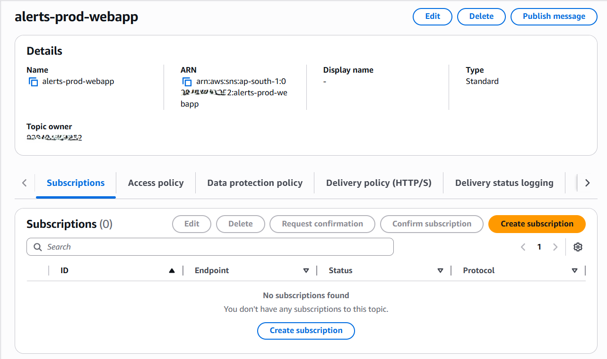
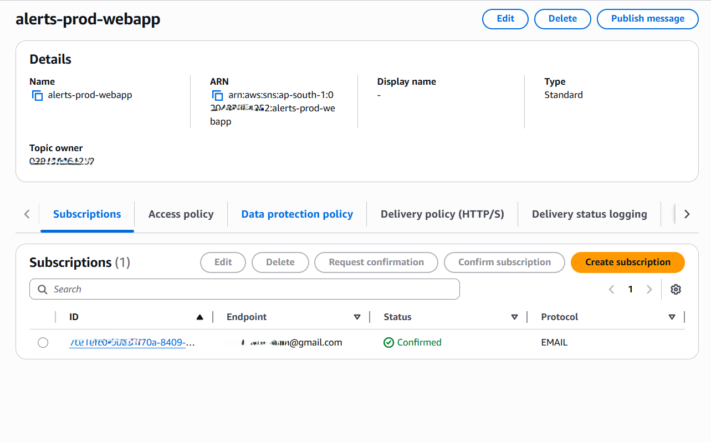
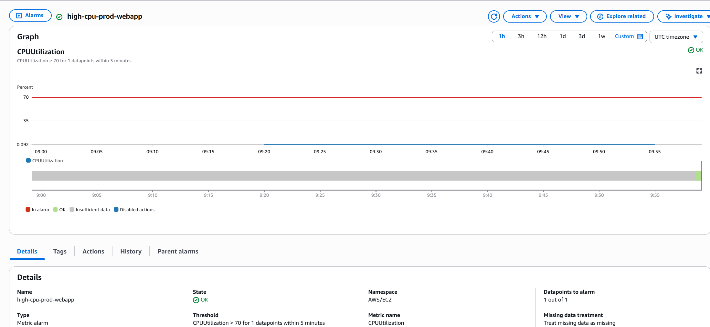
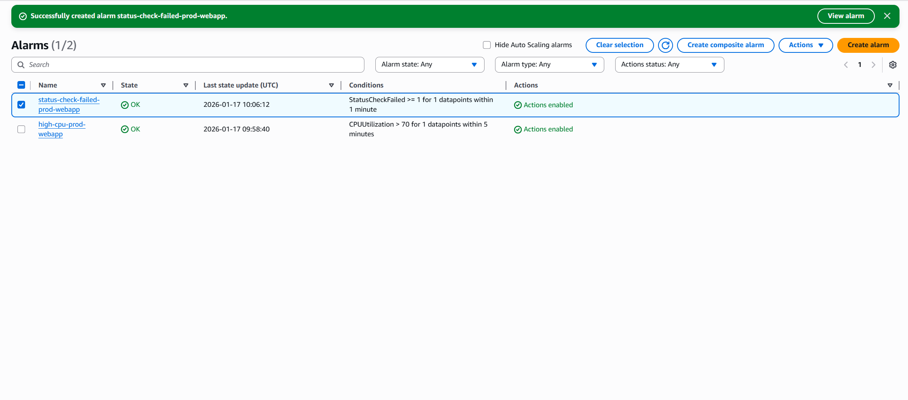
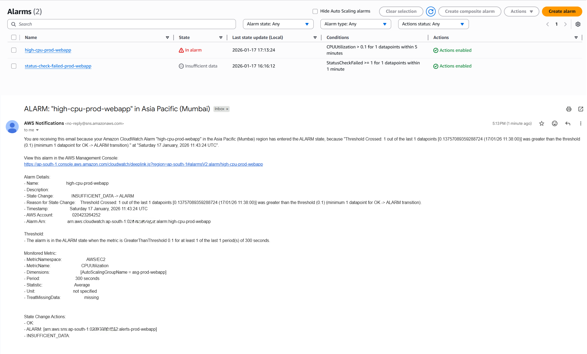

# Phase 6: Monitoring & Alerts (CloudWatch + SNS)

## Objective
Implement basic monitoring and alerting to ensure infrastructure health visibility and real-time notification of abnormal conditions.

This phase focuses on operational readiness: detecting issues, notifying humans, and validating alert delivery without introducing unnecessary load or cost.

---

## Architecture Summary
- CloudWatch used for infrastructure metrics and alarms
- SNS used as the notification delivery mechanism
- Monitoring aligned with Auto Scaling Group–based infrastructure
- Alerts designed to be actionable and low-noise

---

## Metrics Visibility

Before creating alarms, EC2 and Auto Scaling metrics were verified to ensure data was flowing correctly.

Observed metrics included:
- CPUUtilization
- NetworkIn / NetworkOut
- StatusCheckFailed

These metrics confirm that the instances and Auto Scaling Group are observable via CloudWatch.

**Screenshot:**  

---

## SNS Notification Channel

### SNS Topic
- Name: `alerts-prod-webapp`
- Type: Standard
- Purpose: Central notification channel for infrastructure alerts

### Subscription
- Protocol: Email
- Endpoint: Configured email address
- Subscription confirmed via email

**Screenshots:**  
  

---

## CloudWatch Alarms

### High CPU Utilization Alarm

#### Metric Selection
- Source: Auto Scaling Group–level metrics
- Metric: CPUUtilization

Using ASG-level metrics aligns monitoring with ephemeral, self-healing infrastructure and avoids noisy per-instance alerts.

#### Alarm Configuration
- Condition: CPUUtilization > threshold
- Evaluation period: 5 minutes
- Action: Send notification to `alerts-prod-webapp`

**Screenshot:**  

---

### Instance Health Alarm

#### Metric
- Metric: StatusCheckFailed
- Condition: ≥ 1 for consecutive evaluation periods
- Action: Notify SNS topic

This alarm ensures human visibility even when Auto Scaling automatically replaces unhealthy instances.

**Screenshot:**  

---

## Alarm Validation Strategy

To validate the alerting pipeline without generating artificial CPU load on private instances, the alarm was created using **Auto Scaling Group–level metrics** instead of per-instance metrics.

The CPU threshold was temporarily lowered (e.g., > 0.1%) to trigger the alarm and confirm:
- Alarm state transitions
- SNS notification delivery
- End-to-end alert visibility

After validation, the alarm configuration was restored to its intended production threshold.

This approach mirrors real-world operational practices where alert paths are tested independently of workload generation.

**Screenshot:**  

---

## Security Considerations
- No inbound access was added to instances for testing
- Instances remained in private subnets
- No stress or load-generation tools were used
- Monitoring relied entirely on AWS-native telemetry

---

## Cost Awareness & Resource Lifecycle
- CloudWatch basic metrics and alarms used (Free Tier–safe)
- SNS email notifications incur negligible cost at low volume
- No custom or high-resolution metrics enabled
- No long-term log ingestion configured

This ensures effective observability without unnecessary cost.

---

## Outcome
This phase demonstrates the ability to:
- Monitor infrastructure health effectively
- Design alerts with operational intent
- Validate alert delivery safely
- Separate automation (Auto Scaling) from human awareness (alerts)
- Operate AWS infrastructure responsibly

---

## Project Status
At this stage, the system supports:
- Secure networking
- Controlled access
- Immutable compute
- Load balancing
- Self-healing
- Monitoring and alerting

The infrastructure is now production-observable.

---
